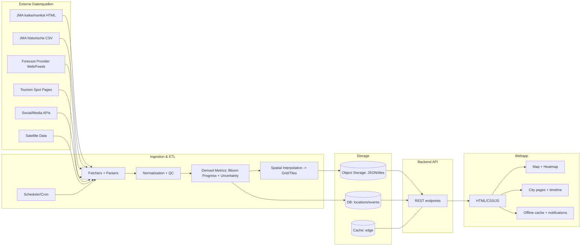
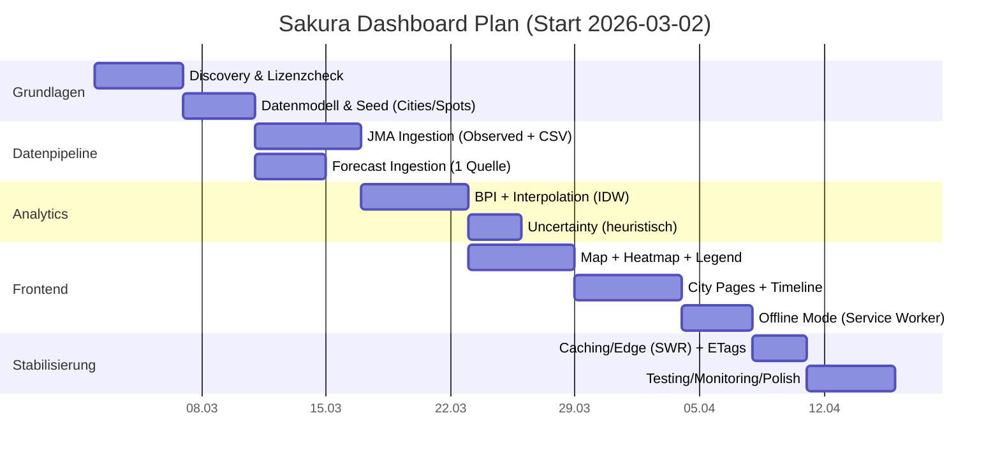

# Implementierungsplan für ein HTML-basiertes Sakura-Dashboard für eine Japanreise

## Executive Summary

Ziel ist eine leichtgewichtige, mobile-first Webapp (HTML/CSS/JS), die den **aktuellen** und **prognostizierten** Kirschblütenstatus über ganz Japan als **Heatmap auf einer Karte** darstellt und zusätzlich **Detailansichten** für die (von dir vorgegebenen) Städte Tokio, Nagoya, Kyoto, Osaka, Okayama, Hiroshima, Kanazawa, Takayama und Nagano bietet. Kernprinzip ist eine **realistische, datengetriebene Darstellung** mit **klar kommunizierter Unsicherheit**, statt „Pseudo-Genauigkeit“ aus spärlichen Daten abzuleiten.

Für „Observed“ (beobachtete) Ereignisse ist die wichtigste Primärquelle die offizielle Sakurabeobachtung der JMA (Japan Meteorological Agency): Die JMA veröffentlicht für jedes Jahr Übersichten zu **开花 (kaika; Beginn)** und **満開 (mankai; Vollblüte)** und aktualisiert diese Seiten in der Saison **dreimal täglich** (08:30/11:30/17:30). citeturn2view0turn2view1turn2view2 Die JMA stellt außerdem historische Beobachtungsdaten als **CSV-Downloads** bereit – ideal für Trends, Normalwerte und Modellkalibration. citeturn5view0turn2view2

Für „Forecast“ (Prognose) existieren mehrere etablierte Anbieter, die sich explizit auf JMA-Kriterien stützen. Die Japan Weather Association (JWA) publiziert saisonale Prognosen (u. a. in Englisch) und beschreibt auch, welche Eingangsdaten genutzt werden (Temperaturbeobachtungen seit Herbst + Temperaturprognosen bis zur Blüte). citeturn12view0turn12view1 Ein weiterer großer Anbieter ist Japan Meteorological Corporation (JMC) mit großflächiger Abdeckung (≈1.000 Spots) und regelmäßigen Updates. citeturn12view5turn5view1 Zusätzlich bieten Anbieter wie entity["company","Weathernews","weather app company"] Spot-spezifische Vorhersagen (z. B. für Takayama) und teilweise Crowdsourcing-Reporte. citeturn17view0turn13search4

Stand deiner lokalen Referenzzeit (Europa/Berlin) am **2. März 2026** gilt: Offizielle Beobachtungen betreffen zu diesem Zeitpunkt typischerweise vor allem die südlichen Regionen (u. a. Okinawa mit anderen Sakura-Arten), während für die Hauptinseln die relevanten Ereignisse überwiegend noch **vor** dem Blühfenster liegen und daher in der App primär als **Forecast** + Unsicherheitsband abgebildet werden sollten. citeturn3view0turn3view4turn5view3turn12view5

Empfohlene Umsetzungsstrategie ist ein zweistufiger Plan:  
Ein MVP baut auf (a) JMA „Observed“ + JMA-Historie (CSV) und (b) einem Forecast-Feed (z. B. Weathermap/JWA/JMC – unter Beachtung der Nutzungsbedingungen) und nutzt eine robuste, erklärbare Interpolation (IDW oder kernel-gewichtete Glättung) plus Unsicherheitsindikator. citeturn14search0turn14search2turn14search37 Danach kann Version 2 ein stärkeres Uncertainty-Modell (z. B. Kriging/Gaussian Process Regression) und optional satelliten-/bildbasierte Signale ergänzen. citeturn14search37turn14search1turn9search19

## Datenquellen und Lizenzlage

### Primärquellen für „Observed“ und Historie

Die JMA betreibt eine zentrale Seite zur **biologischen Saisonbeobachtung** (生物季節観測), inklusive einer Sakura-Sektion mit:
- Jahresaktuellen Übersichten „本年のさくらの開花状況“ (kaika) und „本年のさくらの満開状況“ (mankai) mit 3× täglicher Aktualisierung in der Saison. citeturn2view2turn2view0turn2view1  
- Historischen Tabellen und CSV-Downloads („累年値ファイル“) u. a. für „★さくら開花“ und „★さくら満開“. citeturn5view0turn2view2  

Für Wiederverwendung ist entscheidend: Inhalte der JMA-Website sind (ohne abweichende Rechtekennzeichnung) unter Bedingungen nutzbar, die sich an der **Public Data License (Version 1.0)** orientieren (inkl. korrekter Quellenangabe). citeturn6search1turn6search0turn6search2  
Das ist ein großer Vorteil für ein Reise-Dashboard, weil du „Observed“-Daten rechts- und attribution-sicher verarbeiten kannst, solange du die Bedingungen einhältst (Quellenhinweis, keine Irreführung, etc.). citeturn6search1turn6search2

### Prognosequellen für „Forecast“

Mehrere seriöse Prognoseanbieter (meteorologische Organisationen/Unternehmen) nutzen explizite Kriterien und veröffentlichen Forecasts in der Saison, u. a.:

- entity["organization","Japan Weather Association","weather association japan"]: Veröffentlichungsplan (mehrere Releases von Jan–Apr) und methodische Hinweise (Temperaturbeobachtungen seit Herbst + Temperaturprognosen bis zur Blüte). citeturn12view0turn12view1  
  Wichtig: Auf JWA-Seiten kann es Hinweise geben, dass bestimmte Inhalte nicht für „unauthorized corporate use“ gedacht sind – das betrifft zwar nicht automatisch ein privates Reiseprojekt, ist aber ein Compliance-Risiko und sollte in der Implementierung berücksichtigt werden (z. B. nur offiziell erlaubte Datenkanäle, Caching, keine aggressive Weiterverbreitung). citeturn12view1

- Japan Meteorological Corporation (JMC): Saisonupdates (z. B. „6th forecast“ vom 26. Feb 2026) und Abdeckung von ~1.000 Viewing Locations; nächste Updates werden angekündigt. citeturn12view5turn13search12  
  JMC betreibt zusätzlich einen **kommerziellen Datendienst** („桜開花満開予想データ（全国）“ als CSV, ~1.000 Spots, Auslieferung um ca. 9 Uhr) – das ist für professionelle/zuverlässige ETL attraktiv, aber kosten-/vertragspflichtig. citeturn5view1

- entity["company","Weather Map","japan weather company"]: Ein englischer Forecast, der explizit auf JMA-Beobachtungsbäumen (58 Offices) basiert; Update-Regime: ab 2. März tägliche Reports und Forecasts montags/donnerstags. citeturn5view3  
  Zudem dokumentiert Weathermap die Blühkriterien (First bloom 5–6 geöffnete Blüten; Full bloom 80%). citeturn5view3

- entity["company","Weathernews","weather app company"]: Spot-Seiten mit Stufen (z. B. „tsubomi“) und prognostizierten Terminen (z. B. Takayama/„Nakabashi area“). citeturn17view0turn13search4

- Japan National Tourism Organization (JNTO): Eine touristische „Forecast“-Übersicht (mehrsprachig) mit Datumsangaben pro Region und explizitem Quellenhinweis auf JWA/tenki.jp; geeignet als nutzerfreundliche, sekundäre Referenz (nicht als primäre „Observed“-Quelle). citeturn16view1

### Social-/Crowd- und Media-Quellen

Crowd- und Social-Daten können das Dashboard „füllen“, wo es zwischen wenigen offiziellen Messpunkten Lücken gibt – aber sie sind stark von API-Restriktionen, Bias und Moderation abhängig.

- entity["company","X","social media platform"]: Rate Limits sind endpoint-spezifisch; Überschreitungen führen zu 429-Fehlern bis zum Reset. citeturn11search0turn15search1  
- Meta Graph API (für z. B. Instagram Plattformzugriff): Rate Limiting ist abhängig vom Use-Case/BUC. citeturn11search5  
- entity["company","Flickr","photo sharing service"]: API Terms of Use sind bindend (Lizenz/Verwendungsregeln). citeturn11search2turn11search14  
- entity["company","YouTube","video platform"]: YouTube Data API arbeitet mit Quota-System (Default-Kontingent in Einheiten/Tag) und Compliance-Audits. citeturn11search7turn11search37

### Satellitendaten/NDVI und „Flower indices“

Satelliten sind attraktiv für großflächige Abdeckung – aber „Blüten“ sind visuell/physikalisch schwerer zu messen als „Grünheit“.

- NASA MODIS Vegetation Index (NDVI/EVI) liefert konsistente Vegetationsindizes in **16‑Tage‑Kompositen**; gut für „Greenness“, weniger direkt für Blüten. citeturn9search0turn9search12  
- Sentinel‑2 (Copernicus) bietet multispektrale Daten mit **hoher räumlicher Auflösung** und ca. **5‑Tage Revisit**; Datenzugang ist grundsätzlich „free/full/open“ unter EU-Regeln. citeturn9search14turn9search7turn9search21  
- Forschungslage: Klassische Vegetationsindizes (z. B. NDVI) sind für Blütenereignisse oft nicht optimal; neuere Ansätze nutzen Farbindizes (z. B. „Flower Color Index“) oder Bildklassifikation. citeturn9search19turn9search15turn9search2  

### Vergleichstabelle der wichtigsten Datenquellen

| Quelle | Typ | Abdeckung | Update-Kadenz | Zugang | Verlässlichkeit | Sprachen | Hinweise |
|---|---|---:|---|---|---|---|---|
| JMA „本年のさくらの開花/満開状況“ | Observed | Dutzende Beobachtungspunkte (inkl. Regionaltabellen) | 3× täglich (Dez–Jun) citeturn2view0turn3view4 | HTML (Scraping), verlinkt über Sakura-Datensektion citeturn2view2 | Sehr hoch (amtlich) | JP | Verschiedene Sakura-Arten in Regionen (z. B. Okinawa) werden ausgewiesen. citeturn3view0 |
| JMA CSV „生物季節観測累年値ファイル“ | Historie | Langjährige Zeitreihen pro Station/Phänomen | Unregelmäßig/bei Aktualisierung | CSV-Download citeturn5view0 | Sehr hoch | JP | Ideal für Normalwerte, Trend- und Unsicherheitsmodelle. |
| JWA Forecast (Press Release/Weather X) | Forecast | 53+ Orte (später ~80+) | Mehrere Releases, ab März wöchentlich citeturn12view0turn12view1 | Web; Nutzung teils eingeschränkt (Hinweis zu unauthorized corporate use) citeturn12view1 | Hoch | EN/JP | Methodik erklärt (Temperaturdaten + Prognosen). citeturn12view1 |
| JMC Forecast | Forecast | ~1.000 Spots | Timely updates, z. B. Update-Ankündigung „next update“ citeturn12view5 | Web + (kommerziell) CSV/HTTP-GET Service citeturn5view1 | Hoch | EN/JP | Sehr wertvoll für Spot-Granularität, ggf. kostenpflichtig. |
| Weathermap Forecast | Forecast + Reports | 53 Punkte (ohne Amami/Okinawa in Forecast) | ab 2. März tägliche Reports, Forecast Mo/Do citeturn5view3 | Web | Mittel–hoch | EN/JP | Kriterien identisch zu JMA (5–6 Blüten / 80%). citeturn5view3 |
| Weathernews Spotpages | Spot-Forecast + Crowd | viele Spots | laufend | Web | Mittel–hoch | JP | Liefert stufige Angaben + Datumskaskade (z. B. Takayama). citeturn17view0 |
| Lokale Tourismusinfos Takayama | Spot-Status | Takayama Spots | geplant ab 1. Apr (für 2026) citeturn16view0 | Web | Mittel–hoch | JP | 7‑Stufen-Status (tsubomi…hazakura) als UI-Vorbild. citeturn16view0 |
| Copernicus Sentinel‑2 | Satellit | global | ~5 Tage (Revisit) citeturn9search14 | Portale/Cloud-APIs; free/open citeturn9search21 | Hoch | EN | Für Blüten eher experimentell; Cloud-Handling nötig. |
| NASA MODIS NDVI | Satellit | global | 16‑Tage Komposite citeturn9search0turn9search12 | NASA Earthdata | Hoch | EN | Gut für Vegetationsdynamik; Blüten-Signal indirekt. |
| Social APIs (X, Flickr, YouTube) | Crowd/Media | global | near-real-time | API-Keys + Quotas/Limits citeturn11search0turn11search7turn11search2 | Variabel | EN | Ergänzend; Bias/Moderation, Rate Limits und ToS zentral. |

## Datenmodell und Datenpipeline

### Datenmodell: Felder, Zeitauflösung, Geo-Granularität

Ein praxistaugliches Modell trennt strikt zwischen **Ereignissen** (First bloom / Full bloom), **Statusstufen** (z. B. 7‑Stufen-Skala), und **abgeleiteten Rasterwerten** (Heatmap). Das vermeidet die häufige Falle, „Status“ mit „Ereignisdatum“ zu verwechseln.

**Empfohlene Kernobjekte**

- `Location` (Stadt/Spot/Station)  
  Felder: `location_id`, `name`, `type` (`city|spot|station`), `lat`, `lon`, optional `elevation_m`, `admin_area` (Präfektur), `source_refs[]`.

- `PhenologyEvent` (Observed oder Forecast)  
  Felder: `event_id`, `location_id`, `phenophase` (`first_bloom|full_bloom`), `date_local`, `is_observed` (bool), `source`, `published_at`, `valid_for_season`, `confidence` (z. B. `low|med|high`), `notes`.

- `BloomStage` (laufender Status in Stufen; optional)  
  Felder: `location_id`, `stage` (z. B. 0–6 oder enum), `stage_label_ja/de/en`, `observed_at`, `source`, `evidence` (z. B. offizielles Bulletin, Spotreport).  
  Die 7‑Stufen-Skala aus Takayama (tsubomi … hazakura) ist ein gutes UX-Referenzmuster. citeturn16view0

- `GridCellStatus` (Heatmap-Kachel)  
  Felder: `grid_id`, `date_local`, `lat_center`, `lon_center`, `status_value` (0–1), `uncertainty_value` (0–1), `support_points` (Anzahl), `nearest_distance_km`, `source_mix`.

**Zeitauflösung**
- Ereignisdaten: *einmal pro Jahr pro Phase und Standort* (First bloom / Full bloom). Kriterien sind standardisiert (5–6 Blüten, bzw. 80% Blüten). citeturn12view0turn5view3turn1search25  
- Heatmap/Status: üblicherweise *täglich* (für Reiseplanung), mit Intraday-Updates möglich, wenn primäre Quellen das hergeben (JMA 3×/Tag). citeturn2view0turn2view1

**Geo-Granularität**
- National: Raster 0,1° (~11 km) oder 10 km Grid (gute Balance aus Detail vs. Rechen-/Payloadkosten).  
- Städte: 1–N Spots pro Stadt + optional repräsentative Station (z. B. JMA-Office oder „Sample tree“-Nähe). Weathermap/JWA arbeiten explizit mit JMA-Beobachtungsbäumen an Offices. citeturn5view3turn12view0

### ETL- und Update-Strategie

Ein realistischer ETL-Plan orientiert sich an den Veröffentlichungsrhythmen der Quellen:

- JMA „kaika/mankai“: Pull 3× täglich (mit ±15 min Puffer), weil die Seiten diese Frequenz angeben. citeturn2view0turn2view1  
- Weathermap: ab 2. März tägliche Reports + Forecast Mo/Do. citeturn5view3  
- JWA: Releases nach Plan, ab März wöchentlich. citeturn12view0turn12view1  
- JMC: Update-Ankündigungen (z. B. „next update: March 5“) sollten als „source_schedule“ im System erfasst werden, damit die App Staleness korrekt darstellt. citeturn12view5  
- Takayama Tourismus: spezifisches Updatefenster (für 2026: Update ab 1. April geplant). citeturn16view0

Wichtig ist ein **Staleness-Konzept**: Jeder Datensatz trägt `published_at`/`observed_at` und die UI zeigt „zuletzt aktualisiert“, plus automatische **Fallbacks** (siehe unten).

## Heatmap-Algorithmus, Interpolation und Unsicherheit

### Zielgröße: „Bloom Progress Index“ statt „Bloom/No Bloom“

Eine reine „Blüte ja/nein“-Heatmap ist zu grob für Reiseentscheidungen. Empfehlenswert ist ein skalarer **Bloom Progress Index** \(BPI\) in \([0,1]\), der aus Ereignisdaten abgeleitet wird:

- 0.0 = Vorphase (Knospen/keine Blüte)  
- 0.5 = First bloom (kaika) erreicht  
- 0.8 = Full bloom (mankai) erreicht  
- 1.0 = Nachphase (Abblühen/Blätter; optional)

Die Kriterien für kaika/mankai sind weitgehend standardisiert (z. B. 5–6 Blüten bzw. 80% Blüten), was die Normalisierung zwischen Quellen erleichtert. citeturn12view0turn5view3turn1search25

**Abbildung von Daten zu BPI (praktikabel im MVP)**  
- Wenn *Observed* vorhanden: BPI wird als stückweise Funktion des Kalendertags um Observed-Daten zentriert (z. B. 0 → 0.5 am kaika-Tag, 0.5 → 0.8 am mankai-Tag).  
- Wenn nur Forecast vorhanden: dieselbe Abbildung, aber Unsicherheit höher.  
- Wenn nur Normalwerte/Historie vorhanden: nutze Normalwerte als groben Prior (mit sehr hoher Unsicherheit).

### Interpolationsmethoden für die Heatmap

Du hast i. d. R. nur diskrete Punkte (Stations-/Spotwerte). Die Karte braucht aber eine Fläche. Dafür sind Interpolationsverfahren sinnvoll:

**IDW (Inverse Distance Weighting) – empfehlenswert fürs MVP**  
IDW nimmt an, dass nahe Punkte ähnlicher sind als entfernte und gewichtet Werte invers zur Distanz. citeturn14search0turn14search3  
Vorteile: sehr einfach, performant, gut erklärbar. Nachteile: keine „echte“ statistische Unsicherheit, empfindlich gegenüber Punktdichte.

**Kernel-gewichtete Glättung (Heatmap/KDE-ähnlich)**  
Klassische Heatmaps via Kernel Density Estimation (KDE) erzeugen Dichteflächen aus Punktclustern (z. B. in QGIS). citeturn14search2turn14search16  
Für deinen Use-Case ist KDE als „Dichte“ weniger passend, aber das **kernel-gewichtete Mittel** (Nadaraya–Watson‑artig) ist ein praktisches Pendant: Es glättet BPI-Werte räumlich, ohne harte IDW-Kanten.

**Kriging / Gaussian Process Regression – empfehlenswert ab Version 2**  
Kriging modelliert räumliche Autokorrelation explizit (Semivariogramm) und liefert neben der Vorhersage auch eine Unsicherheitsabschätzung. citeturn14search37turn14search26  
Für eine „ehrliche“ Heatmap mit Uncertainty-Layer ist das methodisch ideal, allerdings komplexer (Parameter, Stabilität, Rechenzeit).

### Unsicherheitsquantifizierung: was die App ausweisen sollte

Eine zentrale Anforderung ist „Uncertainty quantification“. Praktisch sollte die App mindestens drei Komponenten kombinieren:

- **Räumliche Support-Qualität:** Distanz zum nächsten Messpunkt, Anzahl Punkte im Radius. (Je weiter weg, desto unsicherer.)  
- **Quellenstreuung:** Wenn mehrere Forecast-Quellen genutzt werden, kann die Spannweite der Forecast-Termine pro Ort als Unsicherheitsproxy dienen. (Beispiel siehe Status-Snapshot unten.) citeturn5view3turn12view5turn12view0  
- **Zeitliche Staleness:** Je älter der letzte Update, desto höher die Unsicherheit; bei Raten/Updates ist das a priori bekannt (JMA 3×/Tag; Weathermap daily; etc.). citeturn2view0turn5view3turn12view1

**Im MVP** kannst du Unsicherheit als normierten Score 0–1 aus diesen Heuristiken berechnen. **In Version 2** ersetzt/ergänzt du das durch Kriging/GPR‑Varianz, die in der Methodik „eingebaut“ ist. citeturn14search37turn14search1

### Beispielhafte Heatmap-Parameter (Startwerte)

- Raster: 10 km oder 0,1°  
- Interpolation: IDW  
  - `power p = 2` (Standard-Startwert) citeturn14search3  
  - `k = 8` nächste Punkte oder `radius = 250 km` (je nach Punktdichte)  
- Glättung: optional 15–25 km Post-Filter (leichter Gaussian blur) für visuelle Stabilität  
- Uncertainty:  
  - `u_distance = min(1, nearest_km / 300)`  
  - `u_sources = min(1, (max_date - min_date) / 7 Tage)` (wenn mehrere Quellen)  
  - `u_staleness = min(1, hours_since_update / 24)`  
  - `uncertainty = 0.5*u_distance + 0.3*u_sources + 0.2*u_staleness`

### Satelliten/NDVI als optionales, experimentelles Modul

NDVI aus MODIS/Sentinel‑2 kann langfristige Vegetationsdynamik abbilden, aber Blüten sind schwer zu isolieren. citeturn9search0turn9search19  
Wenn du Satellitendaten einbauen willst, ist es realistisch, dies als „Beta“-Layer zu kennzeichnen und eher mit neueren Farb-/Blütenerkennungsansätzen zu experimentieren (z. B. Flower Color Index oder urbane Klassifikation). citeturn9search19turn9search15turn9search2

## Architektur, Hosting, Caching, Rate-Limits und Datenschutz

### Systemarchitektur



### Frontend-Stack und Visualisierung

Da du eine HTML-basierte Webapp ohne Framework-Präferenz willst, sind zwei sinnvolle Pfade:

- **Minimalistisch (MVP):** Vanilla JS + Web Components oder leichtes Framework (z. B. Preact/Svelte) + Kartenlib + Heatmap-Overlay. Vorteil: geringe Komplexität, schnelle Ladezeit, offline-freundlich.
- **Komfort (Team/Erweiterbarkeit):** React/Vue + Vite + State-Management; nützlich, wenn du viele Features (Itinerary, Accounts, Uploads) planst.

Offline/Low-Bandwidth ist am saubersten über **Service Worker + CacheStorage** (App-Shell caching, daten- und tile-basiertes caching). citeturn10search0turn10search4turn10search8

### Kartenbibliotheken: Kosten, Lizenz, Features

| Bibliothek | Kostenmodell | Lizenzlage | Stärken | Risiken/Trade-offs |
|---|---|---|---|---|
| Leaflet | gratis | BSD‑2‑Clause citeturn7search0turn7search11 | sehr leichtgewichtig, riesiges Plugin-Ökosystem | Rastertile-basiert; für sehr große Datenmengen ggf. limitierte GPU-Nutzung |
| MapLibre GL JS | gratis | permissive OSS-Lizenz (BSD‑ähnlich) citeturn7search2turn7search5 | WebGL/Vektor-Rendering, performant, moderne Styles | höherer initialer Setup-Aufwand (Tiles/Styles) |
| Mapbox GL JS | paywall/ToS-gebunden | proprietär, Nutzung an Mapbox Terms gekoppelt citeturn7search12turn7search8 | sehr starke UX, Data-Services, SDKs | laufende Kosten/Komplexität, Vendor lock-in |
| Google Maps Platform | pay-as-you-go | kommerzielle Terms; Kredit/Pläne citeturn7search3turn7search10turn7search14 | vertraute UX, starker POI/Places-Stack | Kostenkontrolle + API-Key/Billing-Pflicht |

Für ein privates Reise-Dashboard mit kontrollierbarer Kostenbasis ist **Leaflet oder MapLibre** plus OpenStreetMap-Daten am realistischsten. OpenStreetMap-Daten sind ODbL-lizenziert (Attribution erforderlich), aber **die öffentlichen Tile-Server sind kein „kostenloser CDN“**: Es gibt eine Tile Usage Policy und Kapazitätslimits; bei größerem Traffic solltest du einen Tile-Provider oder eigene Tiles nutzen. citeturn8search0turn8search9

### Backend, Hosting und Skalierung

**Empfohlene Architektur (robust, aber nicht „overbuilt“):**
- Frontend als statische Assets auf CDN/Static Hosting.
- Backend als kleine API-Schicht (Serverless Functions) + Scheduled Jobs für ETL.
- Storage:
  - DB für strukturierte Daten (Locations/Events).
  - Object Storage/CDN für vorcomputierte Daily-Grids (JSON oder Vektor-/Rastertiles).

**Warum Precompute?**  
Heatmap-Interpolation und Uncertainty-Kalkulation sind deterministisch für einen Tag. Vorberechnen reduziert Latenz und schützt dich vor „thundering herds“, wenn du unterwegs oft reloadest.

### Update-Frequenz, Caching und Fallbacks

**Caching (Edge + Browser)**
- HTTP Caching ist standardisiert (Cache-Control/ETag/Last-Modified). citeturn10search2turn10search18  
- „stale-while-revalidate“ ist ein praxistaugliches Muster, um immer schnell *etwas* auszuliefern und im Hintergrund zu aktualisieren; CDNs wie entity["company","Cloudflare","cdn provider"] unterstützen das, wenn die Header korrekt gesetzt sind. citeturn10search3turn10search11turn10search19

**Fallback-Strategien (wenn Daten fehlen)**
- Wenn „Observed“ fehlt: fall back auf Forecast (mit hoher Unsicherheit).
- Wenn Forecast-Quelle nicht erreichbar: fall back auf (a) zweite Forecast-Quelle oder (b) Normalwert aus Historie (JMA CSV). citeturn5view0turn12view5  
- Wenn Map tiles throttled: fall back auf vereinfachte Basemap (z. B. reduzierte Zoomstufen, offline cached tiles) unter Beachtung der Tile-Policies. citeturn8search9turn8search21

### Rate-Limit Handling und Privacy

**Rate-Limits (client- und serverseitig)**
- HTTP 429 ist standardisiert; Retry-After sollte respektiert werden. citeturn15search1turn15search5  
- X API dokumentiert Rate Limits pro Endpoint und 429 bei Überschreitung. citeturn11search0  
Implementierung: Exponential Backoff + zentraler Request-Queue + Cache (Server) damit die App nicht „pro Nutzer“ die APIs abfragt.

**Datenschutz**
Wenn du Standort, Favoriten, Itinerary oder Notification-Subscriptions speicherst, solltest du „privacy by design/by default“ umsetzen (Datenminimierung, nur notwendige Daten). citeturn15search7turn15search16  
Für Push/Notifications gilt: User-Opt‑In; die Push API ist explizit für background messages gedacht. citeturn10search1turn10search5turn10search21

## UX, City-Ansichten, Feature-Priorisierung und Zeitplan

### UX: Interaktionen, City-Detailseiten, Timeline, Alerts

Die UX sollte die Reiseentscheidung („Wo fahre ich morgen hin?“) direkt unterstützen:

- **Karte + Heatmap** als Default-Start: Zoom-/Pan, Legend, Umschalter „Observed vs Forecast vs Mixed“, Overlay „Unsicherheit“ (z. B. Schraffur/Opacity).
- **Zeitachse** (Timeline-Slider) zum „Vor-/Zurückblättern“: zeigt, wie die „Sakura-Front“ wandert (Forecast) und wann Observations eingetroffen sind.
- **City-Detailseiten**: kompakt, mit 3 Ebenen:
  - (1) Stadtzusammenfassung (Forecast window + confidence)  
  - (2) Spots (Top 3–5) mit Statusstufen  
  - (3) Wetterkontext (optional: nur leichtgewichtig)
- **Alerts/Notifications**: Auslösen, wenn (a) ein ausgewählter Ort „kaika“ erreicht, (b) du in der Nähe eines Spots bist (falls du GPS nutzt), oder (c) Forecast-Window sich stark verschiebt. Push API/Notifications API sind die Web-Standards. citeturn10search1turn10search17
- **Localization**: Inhalte mindestens DE/EN/JA. JNTO ist bereits multilingual; ein i18n-Layer sollte feste Keys + Fallback-Strategie haben. citeturn16view1
- **Offline/Low-Bandwidth Mode**: „App Shell“ offline, letzte bekannten Daten + vorab gecachte Tiles für deine Reiseroute. Service Worker ist das Standardmuster. citeturn10search4turn10search16

image_group{"layout":"carousel","aspect_ratio":"16:9","query":["Japan cherry blossom forecast map heatmap","Leaflet heatmap example map","Sakura forecast app screenshot Japan","cherry blossom viewing map Japan"],"num_per_query":1}

### Status-Snapshot für deine Städte

Für die City-Detailseiten ist es sinnvoll, mehrere Quellen zu spiegeln und daraus ein „Forecast Window“ abzuleiten. Beispielhaft (für 2026, aus öffentlich sichtbaren Forecast-Seiten):

- Weathermap listet u. a. Tokio, Nagoya, Kyoto, Osaka, Okayama, Hiroshima, Kanazawa, Nagano inkl. First/Full bloom. citeturn5view3  
- JMC nennt Forecasts (First/Full bloom) für mehrere Hauptstädte und Abweichung vom Normalwert. citeturn12view5turn13search12  
- Für Takayama liefert Weathernews Spot-spezifische Kaskaden (bloom, five-bloom, full bloom, sakura-fubuki). citeturn17view0  
- JNTO zeigt eine übersichtliche Forecast-Tabelle und weist als Quelle JWA/tenki.jp aus. citeturn16view1  
- Für Takayama existiert zusätzlich ein lokales 7‑Stufen-Statusformat (Update ab 1. April geplant). citeturn16view0

**Beispielhafte Forecast-Termine (Auszug)**
- Tokio: First bloom 3/17 (Weathermap) vs 3/18 (JMC) vs 3/21 (JWA/über JNTO) → Window ≈ 3/17–3/21. citeturn5view3turn12view5turn16view1  
- Osaka: First bloom 3/23 (Weathermap/JMC) vs 3/25 (JWA/über JNTO). citeturn5view3turn12view5turn16view1  
- Kanazawa: First bloom 3/30–3/31 (Weathermap/JMC/JNTO). citeturn5view3turn12view5turn16view1  
- Takayama (Spot „Nakabashi area“): Bloom 4/5, Full bloom 4/11. citeturn17view0

Diese Streuung ist genau das, was dein Dashboard transparent machen sollte: nicht „ein Datum“, sondern **ein Fenster mit Confidence**.

### Feature-Backlog mit Priorisierung

| Feature | Nutzen für Reise | Datenverfügbarkeit | Komplexität | Aufwand | Priorität |
|---|---|---|---|---|---|
| Nationale Karte mit Heatmap (Forecast+Observed) | sehr hoch | hoch (JMA + Forecastseiten) citeturn2view0turn5view3 | mittel | mittel | must |
| City-Detailseiten für deine Städte | sehr hoch | hoch (Weathermap/JMC/JNTO; plus Takayama Spot) citeturn5view3turn12view5turn17view0turn16view1 | mittel | mittel | must |
| Timeline-Slider (Tage) | hoch | hoch | mittel | mittel | must |
| Uncertainty-Layer (heuristisch) | hoch | hoch | mittel | mittel | must |
| Quelle/Attribution & „letztes Update“ | hoch | hoch (JMA/JWA/JMC Lizenzhinweise) citeturn6search1turn12view1turn12view5 | niedrig | niedrig | must |
| Offline/Low-Bandwidth Mode (App Shell) | hoch | hoch (Web-Standards) citeturn10search4turn10search0 | mittel | mittel | should |
| Favoriten & persönliche Route (local-first) | hoch | hoch | mittel | mittel | should |
| Alerts/Notifications (Push/Web) | mittel–hoch | mittel (Opt-in nötig) citeturn10search1turn10search5 | hoch | mittel–hoch | should |
| Forecast-vs-Observed Vergleich (Delta, Bias) | mittel | hoch (JMA + Forecast) citeturn2view0turn12view0 | mittel | mittel | should |
| Crowd-Reports (Text/Foto Upload) | mittel | nur mit eigener Infrastruktur + Moderation | hoch | hoch | could |
| Social-Media-Ingestion (X/Flickr/YouTube) | mittel | eingeschränkt durch Quotas/ToS citeturn11search0turn11search2turn11search7 | hoch | hoch | could |
| Satellitenlayer (NDVI/FCI) | niedrig–mittel | offen, aber methodisch schwierig citeturn9search0turn9search19 | sehr hoch | hoch | could |

### API-Endpunkte und Beispielschemas

**Empfohlene Endpunkte (REST, read-optimized)**

```text
GET /api/v1/health
GET /api/v1/metadata/sources
GET /api/v1/map/heatmap?date=2026-03-02&mode=mixed
GET /api/v1/map/uncertainty?date=2026-03-02&mode=mixed

GET /api/v1/cities
GET /api/v1/cities/{slug}?date=2026-03-02
GET /api/v1/cities/{slug}/timeseries?start=2026-03-01&end=2026-04-30

GET /api/v1/spots?city={slug}
GET /api/v1/spots/{spot_id}?date=2026-03-02
```

**Beispiel-JSON: City Detail Response**

```json
{
  "city": {
    "slug": "tokio",
    "name": {"de": "Tokio", "en": "Tokyo", "ja": "東京"},
    "lat": 35.6895,
    "lon": 139.6917
  },
  "date_local": "2026-03-02",
  "summary": {
    "bloom_progress_index": 0.05,
    "status_label": {"de": "Vor Knospenöffnung (Forecast)", "en": "Pre-bloom (forecast)", "ja": "つぼみ（予想）"},
    "forecast_window": {
      "first_bloom": {"min": "2026-03-17", "max": "2026-03-21"},
      "full_bloom": {"min": "2026-03-25", "max": "2026-03-26"}
    },
    "uncertainty": 0.62,
    "last_updated_at": "2026-03-02T08:45:00+09:00",
    "sources_used": ["JMA", "Weathermap", "JMC", "JWA"]
  },
  "spots": [
    {
      "spot_id": "tokio_ueno_park",
      "name": {"de": "Ueno Park", "ja": "上野恩賜公園"},
      "lat": 35.7155,
      "lon": 139.7747,
      "stage": "tsubomi",
      "stage_confidence": "medium",
      "events": {
        "first_bloom": {"type": "forecast", "date": "2026-03-23"},
        "full_bloom": {"type": "forecast", "date": "2026-04-01"}
      }
    }
  ]
}
```

### Implementierungszeitplan mit grober Aufwandsschätzung

**Rolle/Annahme:** 1 Full-Stack-Dev + ggf. 0,2–0,5 PM/Design. Aufwände sind grob (Person-Tage), weil Daten-Parsing und Lizenzklärung oft den größten Unsicherheitshebel darstellen.

| Meilenstein | Inhalt | Person-Tage (grob) |
|---|---|---:|
| Discovery & Datenvertrag | Quelleninventar, Nutzungsbedingungen, Parsing-Prototypen | 3–5 |
| Datenmodell & Storage | Locations/Events Schema, Seed-Daten für Städte/Spots | 2–4 |
| Ingestion v1 | JMA kaika/mankai + JMA CSV, ein Forecast-Feed, Scheduler | 4–7 |
| Heatmap v1 | BPI-Berechnung, IDW-Interpolation, Uncertainty-Heuristik | 4–7 |
| Frontend v1 | Karte, Heatmap, Legend, Timeline, City Pages | 6–10 |
| Offline & Cache | Service Worker, Cache-Konzept, Low-bandwidth UI | 2–5 |
| Hardening | Monitoring, Fehlerfälle, „stale“ UI, Tests | 3–6 |
| Optional v2 | Kriging/GPR, Social/Satellit Beta, Push Alerts | 6–15 |



### UI-Mockup als einfache HTML/CSS-Skizze

```html
<!doctype html>
<html lang="de">
<head>
  <meta charset="utf-8" />
  <meta name="viewport" content="width=device-width, initial-scale=1" />
  <title>Sakura Dashboard</title>
  <style>
    :root { --gap: 12px; --panel: 360px; }
    body { margin: 0; font-family: system-ui, sans-serif; }
    header { padding: 12px 16px; border-bottom: 1px solid #eee; display:flex; gap:10px; align-items:center; }
    .layout { display: grid; grid-template-columns: var(--panel) 1fr; height: calc(100vh - 54px); }
    aside { border-right: 1px solid #eee; padding: var(--gap); overflow:auto; }
    main { position: relative; }
    #map { position:absolute; inset:0; background: #f6f6f6; }
    .card { border: 1px solid #eee; border-radius: 10px; padding: 10px; margin-bottom: var(--gap); }
    .row { display:flex; justify-content: space-between; gap: 8px; }
    .pill { font-size: 12px; padding: 2px 8px; border-radius: 999px; border: 1px solid #ddd; }
    .timeline { position:absolute; left: 12px; right: 12px; bottom: 12px;
      background: rgba(255,255,255,0.92); border: 1px solid #eee; border-radius: 12px; padding: 10px; }
    @media (max-width: 900px) {
      .layout { grid-template-columns: 1fr; }
      aside { height: 38vh; border-right: none; border-bottom: 1px solid #eee; }
      main { height: calc(62vh); }
      :root { --panel: 1fr; }
    }
  </style>
</head>
<body>
<header>
  <strong>Sakura Dashboard</strong>
  <span class="pill">Observed</span>
  <span class="pill">Forecast</span>
  <span class="pill">Uncertainty</span>
</header>

<div class="layout">
  <aside>
    <div class="card">
      <div class="row"><strong>Heute</strong><span>2026-03-02</span></div>
      <div>Modus: Mixed (Observed + Forecast)</div>
      <div>Letztes Update: 08:45 JST</div>
    </div>

    <div class="card">
      <strong>Städte</strong>
      <div style="margin-top:8px; display:grid; gap:8px;">
        <button>Tokio</button>
        <button>Kyoto</button>
        <button>Osaka</button>
        <button>Takayama</button>
      </div>
    </div>

    <div class="card">
      <strong>Legende</strong>
      <div style="margin-top:8px;">BPI 0.0 → 1.0 (Vorblüte → Nachblüte)</div>
      <div>Unsicherheit: niedrige Deckkraft = unsicher</div>
    </div>
  </aside>

  <main>
    <div id="map">[Map + Heatmap Layer]</div>
    <div class="timeline">
      <div class="row">
        <span>Zeitleiste</span>
        <span>Hover: zeigt Forecast Window & Quelle</span>
      </div>
      <input type="range" min="0" max="60" value="0" style="width:100%;" />
    </div>
  </main>
</div>
</body>
</html>
```

Dieses Layout priorisiert: schnelle Orientierung (Heatmap), schnelle Drilldowns (City-Buttons) und Reiseentscheidungen (Timeline + Forecast Window). Offline-Optimierung erfolgt, indem du die App-Shell und „letzte bekannte“ JSONs im Service Worker cache speicherst. citeturn10search4turn10search0